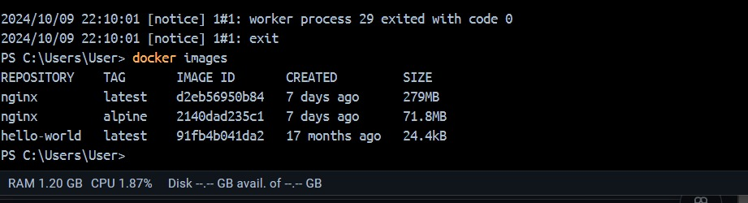

# Imagen
Es un archivo único que contiene todos los programas, librerías, dependencias y configuraciones necesarias para instalar y/o ejecutar una aplicación o un conjunto de aplicaciones.


## ¿Cuál es la relación entre una imagen y un contenedor? 
# COMPLETAR 
````
La imagen es la plantilla, y el contenedor es la ejecución de esa plantilla. Puedes tener varios contenedores creados a partir de una sola imagen, y cada contenedor será una instancia separada de la misma aplicación
````

## Comandos para imágenes

### Descargar imagen
Descarga la última versión de la imagen disponible en el registro de Docker.

```
docker pull <nombre imagen> 
```

Descarga una versión específica de la imagen, cada imagen tiene etiquetas (tags) para diferentes versiones.
Una imagen puede tener la etiqueta latest para representar la última versión, si no se especifica una etiqueta se hará referencia a la versión latest.

```
docker pull <nombre imagen>:<tag>
```

Descargar la imagen **hello-world**
# COMPLETAR
```
*docker pull hello-world*

Using default tag: latest
latest: Pulling from library/hello-world
c1ec31eb5944: Download complete
Digest: sha256:91fb4b041da273d5a3273b6d587d62d518300a6ad268b28628f74997b93171b2
Status: Downloaded newer image for hello-world:latest
docker.io/library/hello-world:latest

Hello from Docker!
This message shows that your installation appears to be working correctly.

To generate this message, Docker took the following steps:
 1. The Docker client contacted the Docker daemon.
 2. The Docker daemon pulled the "hello-world" image from the Docker Hub.
    (amd64)
 3. The Docker daemon created a new container from that image which runs the
    executable that produces the output you are currently reading.
 4. The Docker daemon streamed that output to the Docker client, which sent it
    to your terminal.

To try something more ambitious, you can run an Ubuntu container with:
 $ docker run -it ubuntu bash

Share images, automate workflows, and more with a free Docker ID:
 https://hub.docker.com/

For more examples and ideas, visit:
 https://docs.docker.com/get-started/
````
 
**¿Qué es nginx**
# COMPLETAR 
````
nginx es un servidor web de codigo abierto utilizado por su capacidad para manejar paginas web y diferentes volumenes de trafico
````
Descargar la imagen  **nginx** en la versión **alpine**
# COMPLETAR
````
C:\Users\User> docker pull nginx:alpine
>>
alpine: Pulling from library/nginx
43c4264eed91: Pulling fs layer                                                                             
43c4264eed91: Download complete
472934715761: Download complete
596d53a7de88: Download complete
379754eea6a7: Download complete
d1171b13e412: Download complete
fd072e74e282: Download complete
45eb579d59b2: Download complete
Digest: sha256:2140dad235c130ac861018a4e13a6bc8aea3a35f3a40e20c1b060d51a7efd250
Status: Downloaded newer image for nginx:alpine
docker.io/library/nginx:alpine
````
### Listar imágenes

```
docker images
```

# COLOCAR UNA CAPTURA DE PANTALLA DEL RESULTADO 


**Identificadores**

En Docker, se utilizan varios identificadores para diferenciar de manera única los elementos del sistema, como imágenes, contenedores, volúmenes y redes. Estos identificadores son generados automáticamente por Docker y son únicos dentro del contexto del sistema Docker en el que se encuentran. 

### Inspeccionar una imagen
El comando docker inspect se utiliza para obtener información detallada sobre un objeto de Docker específico, como un contenedor, una imagen, un volumen o una red.  Proporciona información en formato JSON sobre el objeto especificado.

```
docker inspect <nombre imagen>
docker inspect <nombre imagen>:<tag>
```

Inspeccionar la imagen hello-world 
# COMPLETAR
````
docker inspect hello-world
[
    {
        "Id": "sha256:91fb4b041da273d5a3273b6d587d62d518300a6ad268b28628f74997b93171b2",
        "RepoTags": [
            "hello-world:latest"
        ],
        "RepoDigests": [
            "hello-world@sha256:91fb4b041da273d5a3273b6d587d62d518300a6ad268b28628f74997b93171b2"
        ],
        "Parent": "",
        "Comment": "buildkit.dockerfile.v0",
        "Created": "2023-05-02T16:49:27Z",
        "DockerVersion": "27.2.0",
        "Author": "",
        "Config": {
            "Hostname": "",
            "Domainname": "",
            "User": "",
            "AttachStdin": false,
            "AttachStdout": false,
            "AttachStderr": false,
            "Tty": false,
            "OpenStdin": false,
            "StdinOnce": false,
            "Env": [
                "PATH=/usr/local/sbin:/usr/local/bin:/usr/sbin:/usr/bin:/sbin:/bin"
            ],
            "Cmd": [
                "/hello"
            ],
            "ArgsEscaped": true,
            "Image": "",
            "Volumes": null,
            "WorkingDir": "/",
            "Entrypoint": null,
            "OnBuild": null,
            "Labels": null
        },
        "Architecture": "amd64",
        "Os": "linux",
        "Size": 15288,
        "GraphDriver": {
            "Data": null,
            "Name": "overlayfs"
        },
        "RootFS": {
            "Type": "layers",
            "Layers": [
                "sha256:ac28800ec8bb38d5c35b49d45a6ac4777544941199075dff8c4eb63e093aa81e"
            ]
        },
        "Metadata": {
            "LastTagTime": "2024-10-09T22:00:06.318171078Z"
        }
    }
]
````
**¿Con qué algoritmo se está generando el ID de la imagen**
# COMPLETAR
````
Se esta generando con sha256
````
### Filtrar imágenes

```
docker images | grep <termino a buscar>

```

### Para eliminar una imagen
Eliminar permanentemente la imagen de tu sistema Docker.

```
docker rmi <nombre imagen>:<tag>
```

Eliminar la imagen hello-world 
# COMPLETAR
````
PS C:\Users\User> docker rmi hello-world
Error response from daemon: conflict: unable to delete hello-world:latest (must be forced) - container cc9c1d27ed2d is using its referenced image 91fb4b041da2
PS C:\Users\User> docker ps -a 
CONTAINER ID   IMAGE         COMMAND                  CREATED          STATUS                      PORTS     NAMES
1883dd500d41   nginx         "/docker-entrypoint.…"   10 minutes ago   Exited (0) 9 minutes ago            
  peaceful_nightingale
cc9c1d27ed2d   hello-world   "/hello"                 18 minutes ago   Exited (0) 18 minutes ago           
  naughty_feynman
PS C:\Users\User> ^C
PS C:\Users\User> docker rm cc9c1d27ed2d
cc9c1d27ed2d
PS C:\Users\User> docker rmi hello-world 
Untagged: hello-world:latest
Deleted: sha256:91fb4b041da273d5a3273b6d587d62d518300a6ad268b28628f74997b93171b2
PS C:\Users\User>
````

-f: Es la opción para forzar la eliminación de la imagen incluso si hay contenedores en ejecución que utilizan esa imagen.
Cuando eliminas una imagen Docker, Docker no elimina automáticamente los contenedores que se han creado a partir de esa imagen. Esto significa que, aunque hayas eliminado la imagen, el contenedor seguirá ejecutándose normalmente.  
**Considerar**
Eliminar una imagen no afecta a los contenedores que se han creado a partir de esa imagen, a menos que esos contenedores dependan de archivos o configuraciones específicas de la imagen eliminada. En ese caso, es posible que los contenedores se comporten de manera inesperada después de eliminar la imagen.
Es una buena práctica detener y eliminar todos los contenedores que dependan de una imagen antes de eliminar la imagen en sí.

```
docker rmi -f <nombre imagen>:<tag>
```

