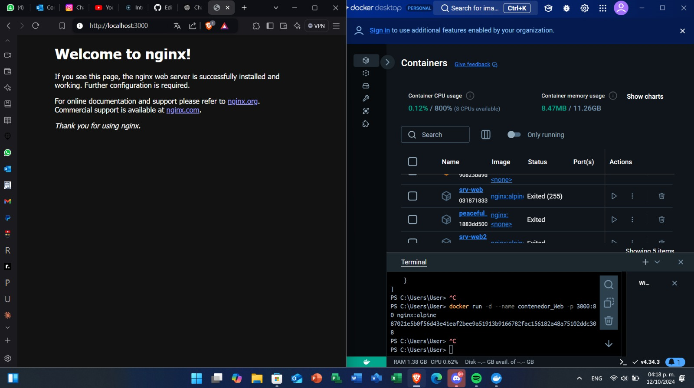

# Mapeo de puertos
El mapeo de puertos es un mecanismo que permite redirigir el tráfico de red desde un puerto en el host (tu máquina local o servidor) hacia un puerto específico en un contenedor Docker.
Por ejemplo, supongamos que tienes un contenedor que ejecuta un servidor web en el puerto 80 dentro del contenedor, pero quieres acceder a ese servidor desde tu navegador en la máquina host. Puedes usar el mapeo de puertos para redirigir el tráfico del puerto 80 del contenedor al puerto 3000 en el host. De esta manera, cuando accedas a http://localhost:3000 en tu navegador, el tráfico se dirigirá al servidor web dentro del contenedor en el puerto 80.


### Para crear un mapeo de puertos (puerto host y puerto contenedor)
El mapeo de puertos se especifica al ejecutar un contenedor Docker utilizando la opción -p o --publish seguida de los puertos que deseas mapear
```
docker run -d --name <nombre contenedor> -p <puerto host>:<puerto contenedor> <nombre imagen>:<tag>

```
Crear un contenedor a partir de la imagen nginx version alpine con el mapeo de puertos del ejemplo gráfico, host 3000 y contenedor 80
# COMPLETAR
````
PS C:\Users\User> docker run -d --name contenedor_Web -p 3000:80 nginx:alpine
87021e5b0f56d43e41eaf2bee9a51913b9166782fac156182a48a75102ddc308
````
# COLOCAR UNA CAPTURA DE PANTALLA  DEL ACCESO http://localhost:3000

### Para mapear más de un puerto

```
docker run -d --name <nombre contenedor> -p <puerto host 01>:<puerto contenedor 01> -p <puerto host 02>:<puerto contenedor 02> <nombre imagen>:<tag>
```

Crear un contenedor a partir de la imagen rabbitmq version management-alpine, para este mapeo de puertos usar en el host los mismos puertos del contenedor.
# COMPLETAR
````
para esto primero descargare la imagen con
docker pull rabbitmq:management-alpine
una ves descargada la imagen
en base a la documentacion de la imagen rabbitmq sus puertos son 5672 y 15672(al usara versiones management)  al usar la imagen en la version descargada sus puertos ya estan predefinidos.
uan vez hechho eso procedemos a ejecutar el siguiente codigo
PS C:\Users\User> docker run -d --name mi-rabbitmq -p 5672:5672 -p 15672:15672 rabbitmq:management-alpine
a15ca6b7bee8aa2c5674a930b50bf8d3b4956b2f2d0df6b0ebbddaf8d3d2e229
````

